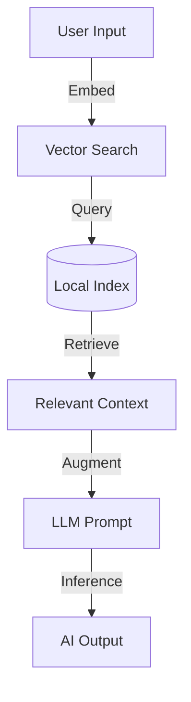
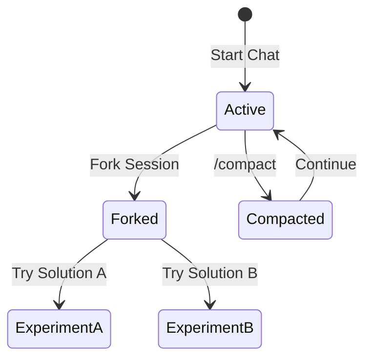
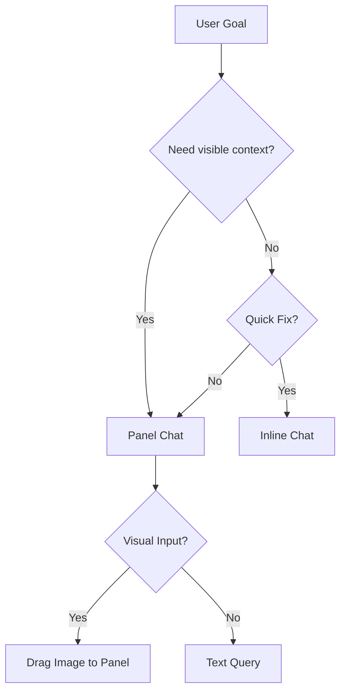
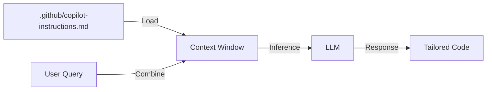
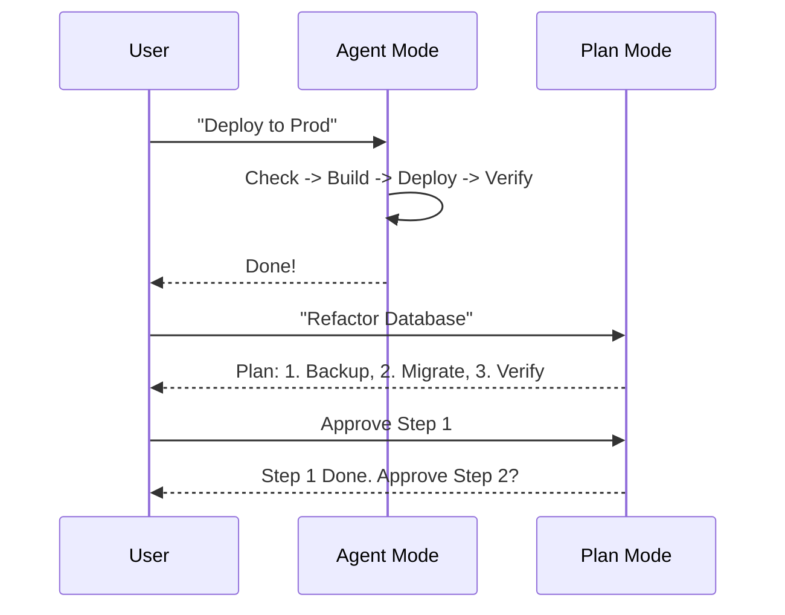
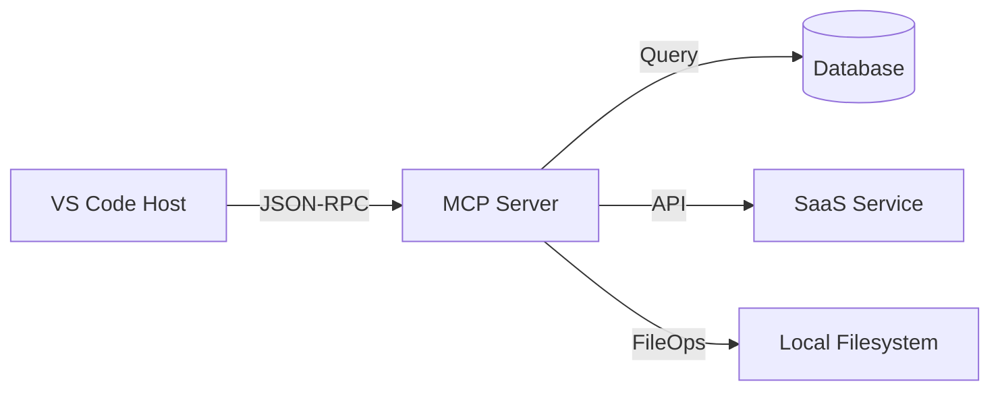
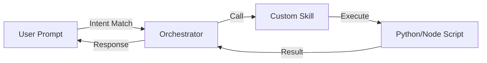
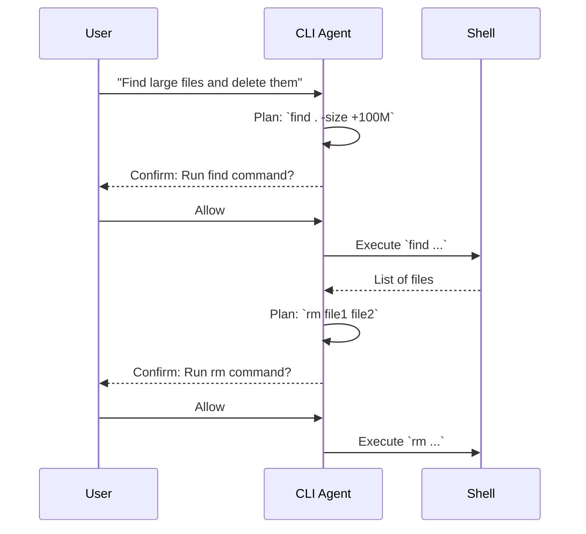
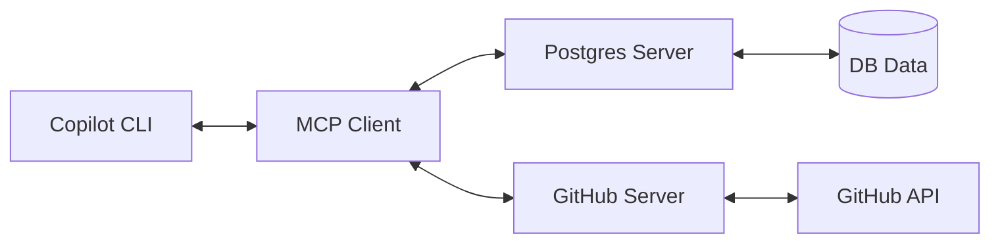

<!-- _class: lead -->

# GitHub Copilot 深度实战培训：从基础到 Agent 智能体
## 聚焦 VS Code 1.109/1.110 最新特性 (2026 Edition)

### 讲师：[您的名字] | GitHub Copilot 官方认证讲师

<!-- speaker_note: 
大家好，欢迎来到 GitHub Copilot 深度实战培训。
本次培训基于最新的 VS Code 1.110 (2026年2月版) 和 1.109 (1月版)。
我们将深入探讨 Copilot 的最新进化：从单纯的代码补全工具，演变为全能的 AI 开发 Agent。
特别涵盖 v1.110 引入的 Agent Plugins、Browser Tools 以及 v1.109 的 Multi-Agent 编排。
-->

---

# 议程概览 (Agenda)

1.  **基础篇 (Basics)**: VS Code 1.109/1.110 新特性与交互范式
2.  **进阶篇 (Advanced)**: 定制化 Agent、MCP 协议与 Skills 生态
3.  **CLI 篇 (CLI)**: 终端里的全能 Agent (Advanced Usage)
4.  **实战演练 (Labs)**: 动手实验与 Q&A

<!-- speaker_note: 
我们将分为三个模块。
第一部分重点介绍 VS Code 1.109 和 1.110 的重大更新，包括 Memory 和 Session 管理。
第二部分深入 Agent 的定制，包括 Custom Instructions 和 MCP。
第三部分是针对高级用户的 CLI 实战。
最后是动手环节。
-->

---

# 环境检查清单 (Prerequisites)

请确保您的环境满足以下要求：

*   **VS Code**: v1.110 (Feb 2026) 或更高版本
*   **Node.js**: v22.0.0 或更高版本 (推荐 LTS)
*   **npm**: v10.0.0 或更高版本
*   **GitHub Copilot Extension**: 最新版本 (v1.160+)
*   **GitHub Copilot CLI**: `@github/copilot` (npm 包)

<!-- speaker_note: 
请大家检查一下 VS Code 版本。
点击 Help -> About，确认是 1.110 或更新。
如果不是，请立即更新，因为很多 Agent 功能（如 Browser Tools）依赖此版本。
CLI 也请使用 npm 安装最新版。
-->

---

<!-- _class: lead -->

# 模块一：基础篇 (Basics)
## VS Code 1.109/1.110 新特性与交互范式

<!-- speaker_note: 
让我们开始第一模块。
这不仅仅是基础，更是全新的工作流。
VS Code 1.110 彻底改变了我们与 AI 的对话方式。
-->

---

# 1. Copilot Memory (v1.109 Preview)

Copilot 现在拥有跨越会话的长期记忆。

*   **Context Retention**: 记住你的项目偏好、技术栈选择。
*   **Project Indexing**: 自动构建本地向量索引。
*   **Action**: `Settings` -> `github.copilot.memory.enable` -> `true`

> "Copilot, remember that we use Vitest instead of Jest."

<!-- speaker_note: 
在 v1.109 中，Copilot 终于有了记忆。
不需要每次都重复 "我用的是 React"。
它会记住你的偏好。
请大家现在去设置里开启 Memory 功能。
-->

---

# Memory: How it Works? (技术揭秘)

Copilot 会在本地 `.git/copilot/index` 目录下维护一个轻量级向量库。



*   **Privacy**: 索引完全存储在本地，不上传云端。
*   **Scope**: 仅当前工作区有效。

<!-- speaker_note: 
大家不用担心隐私问题。
这个记忆是保存在你本地的 .git 目录下的。
它通过向量搜索来增强每一次对话的上下文。
-->

---

# 2. Advanced Session Management (v1.110)

VS Code 1.110 引入了更灵活的会话管理。

*   **Unified Interface**: 统一管理 Copilot, Claude, Local Agents。
*   **Fork Session**: 从某个节点分叉对话，探索不同方案。
*   **Manual Compact**: `/compact` 命令手动压缩上下文，释放 token。



<!-- speaker_note: 
有时候聊着聊着，发现思路错了，想回到三句前？
v1.110 允许你 "Fork" 一个会话。
就像 Git 分支一样，你可以同时探索两个方案。
如果上下文太长，用 `/compact` 把它压缩一下。
-->

---

# Session Forking Demo (演示)

*   **Scenario**: 重构一个复杂的 API 接口。
*   **Branch A**: 尝试使用 GraphQL 方案。
*   **Branch B**: 尝试使用 RESTful 方案。
*   **Action**: 在对话气泡右上角点击 "Fork" 图标。

<!-- speaker_note: 
这个功能在做技术选型的时候非常有用。
你可以在一个分支里试错，而不污染主线对话。
-->

---

# 3. Inline Chat vs Panel Chat (v1.110 Updates)

### Inline Chat (`Cmd+I`)
*   **Update**: 支持 Right-click snippet integration。
*   **Use Case**: 快速修复、局部重构。

### Panel Chat (Sidebar)
*   **Update**: 支持 Drag & Drop 图片 (Vision)、Mermaid 渲染。
*   **Use Case**: 架构设计、复杂问答。



<!-- speaker_note: 
v1.110 增强了 Panel 的视觉能力。
你可以直接把架构图拖进去问 Copilot。
Inline Chat 现在集成到了右键菜单，用起来更顺手。
大家看这个决策树，选择最适合的模式。
-->

---

# Visual Capabilities in Panel (视觉能力)

v1.110 支持直接拖拽截图或设计稿到 Chat Panel。

*   **Design to Code**: 拖入 Figma 截图 -> 生成 HTML/CSS。
*   **Error Analysis**: 拖入报错截图 -> 分析原因。
*   **Architecture**: 拖入白板草图 -> 生成 Mermaid 代码。

<!-- speaker_note: 
以前我们要用 OCR 或者手打。
现在直接拖进去，Copilot 就能看懂你的设计图。
这对于前端开发来说是神器。
-->

---

# 4. Related Files Improvement (v1.110)

Copilot 现在能更聪明地猜出你需要的相关文件。

*   **Algorithm**: 基于 "Edit Distance" 和 "Import Graph" 的混合算法。
*   **UI**: 在 Chat 输入框上方显示 "Used references"。
*   **Manual**: 你也可以通过 `@file` 手动添加。

<!-- speaker_note: 
v1.110 改进了上下文检索算法。
它不仅看文件名，还看引用关系。
你会发现它自动引用的文件越来越准了。
-->

---

# 实战案例 1: Agentic Browser Tools (v1.110 Exp)

Copilot Agent 现在可以操控浏览器进行调试。

1.  **Scenario**: 前端页面显示异常。
2.  **Prompt**: `@browser Check the console logs for the active tab.`
3.  **Action**: Agent 自动连接浏览器，读取 Log，分析错误。

> **Requirement**: 需安装 `GitHub Copilot Browser` 扩展。

<!-- speaker_note: 
这是 v1.110 最酷的功能之一。
Agent 可以直接看浏览器了。
不需要你复制粘贴 console log，它自己去抓。
请大家安装 Browser 扩展体验一下。
-->

---

# 实战案例 2: Multi-Agent Orchestration (v1.109)

让多个子 Agent 并行工作。

1.  **Scenario**: 需要同时生成前端组件和后端 API。
2.  **Prompt**: `Create a User profile page and the corresponding Express API endpoint.`
3.  **Execution**:
    *   Sub-agent A: Writes `UserProfile.tsx`
    *   Sub-agent B: Writes `userController.js`
    *   Orchestrator: Merges and verifies.

<!-- speaker_note: 
v1.109 引入了多 Agent 编排。
以前是串行，现在是并行。
Copilot 会把任务拆分，分发给不同的子模型去跑。
效率提升非常明显。
-->

---

# 实战案例 3: Mermaid Diagrams in Chat (v1.109)

让 Copilot 画图解释代码。

1.  **Scenario**: 理解复杂的鉴权流程。
2.  **Prompt**: `Explain the OAuth2 flow in this project with a sequence diagram.`
3.  **Result**: 直接在 Chat 窗口渲染可交互的 Mermaid 图表。

<!-- speaker_note: 
一图胜千言。
v1.109 开始，Copilot 输出的 Mermaid 代码会自动渲染成图。
你可以直接保存图片，放到文档里。
-->

---

<!-- _class: lead -->

# 模块二：进阶篇 (Advanced)
## 定制化 Agent、MCP 协议与 Skills 生态

<!-- speaker_note: 
接下来进入进阶篇。
我们将学习如何打造团队专属的 Copilot。
利用 v1.110 的 Agent Plugins 和 MCP 协议。
-->

---

# 1. Custom Instructions (v1.110 Global Support)

通过 `.github/copilot-instructions.md` 定义全局规范。

*   **Scope**: Repository Level.
*   **Content**: Role, Tech Stack, Code Style.
*   **Update**: v1.110 增强了对 Instructions 的遵循权重。



<!-- speaker_note: 
Custom Instructions 是必修课。
v1.110 里，它的权重更高了。
Copilot 会优先遵循这里面的规则，而不是通用的训练数据。
-->

---

# Instructions 最佳实践 (Best Practices)

*   **Role Definition**: 定义 Copilot 的角色（如 Senior Java Developer）。
*   **Negative Constraints**: 明确“不要做什么”（如 Don't use `var`）。
*   **Style Examples**: 提供少量“好代码”的示例。

```markdown
# Role
Act as a Senior DevOps Engineer.

# Style Guidelines
- Prefer modular Terraform configurations.
- Always include `description` for variables.
```

<!-- speaker_note: 
不要写作文，要写指令。
用 Bullet points。
多用 Negative Constraints，告诉它不要做什么往往比告诉它要做什么更有效。
-->

---

# Variable Injection in Instructions (进阶技巧)

你可以在 Instructions 中使用变量插值。

*   `{{ active_file }}`: 当前打开的文件名。
*   `{{ selected_code }}`: 当前选中的代码。
*   `{{ language }}`: 当前语言。

**Example**:
`When reviewing {{ language }} code, always check for PEP-8 compliance.`

<!-- speaker_note: 
这让你的 Instructions 更动态。
针对不同语言，应用不同的规则。
-->

---

# 2. Agent Plugins (v1.110 Preview)

将 Skills 打包成 VS Code 插件分发。

*   **Concept**: 一个插件包含一组 Prompts, Skills, Agents。
*   **Distribution**: 通过 VS Code Marketplace 或 VSIX 分发。
*   **Structure**:
    *   `package.json`: 定义 contributions
    *   `skill.json`: 定义能力
    *   `extension.ts`: 实现逻辑

<!-- speaker_note: 
v1.110 带来的新东西：Agent Plugins。
你可以把你们团队的“最佳实践”打包成一个插件。
新人入职，装个插件，Copilot 马上学会你们的所有黑话和流程。
-->

---

# 3. Agent Mode vs Plan Mode

### Agent Mode (Autonomous)
*   **Behavior**: 自动规划、自动执行工具、自动修正错误。
*   **Update**: v1.109 增强了错误恢复能力。

### Plan Mode (Human-in-the-Loop)
*   **Behavior**: 仅生成步骤，每一步需人工确认。
*   **Update**: v1.110 支持 `Plan Memory`，跨会话记住计划。

<!-- speaker_note: 
Agent 模式适合全自动任务，比如部署、清理日志。
Plan 模式适合高风险任务，比如动数据库。
v1.110 让 Plan 即使关掉窗口也能记住进度。
-->

---

# Agent vs Plan Workflow Comparison



<!-- speaker_note: 
这张图清晰展示了两种模式的区别。
左边是“全托”，右边是“半托”。
-->

---

# 4. MCP Protocol (Model Context Protocol)

MCP 是连接 Copilot 与外部数据的标准。

*   **Architecture**:
    *   **Host**: VS Code / CLI
    *   **Client**: Copilot Chat
    *   **Server**: SQLite, Postgres, Slack, Linear...



<!-- speaker_note: 
MCP 是未来的核心。
它让 Copilot 能“看见”数据库里的数据，能“看见”Jira 里的票。
-->

---

# MCP Server 配置 (v1.110 Simplified)

`mcp-configs/sqlite-mcp.json`

```json
{
  "mcpServers": {
    "sqlite": {
      "command": "uvx",
      "args": [
        "mcp-server-sqlite",
        "--db-path",
        "./prod.db"
      ]
    }
  }
}
```

<!-- speaker_note: 
配置非常简单。
只要指定 Server 的启动命令（比如 uvx 或 docker）。
VS Code 会自动管理连接。
-->

---

# MCP 实战: Filesystem Server

让 Agent 访问工作区之外的文件。

*   **Server**: `mcp-server-filesystem`
*   **Config**:
    ```json
    "args": ["/var/log/nginx", "/etc/hosts"]
    ```
*   **Use Case**: 分析系统日志，检查 Host 配置。

<!-- speaker_note: 
默认情况下，Copilot 只能看当前 workspace。
通过 Filesystem MCP，你可以授权它看 /var/log 或者其他目录。
这对于运维诊断非常有帮助。
-->

---

# MCP 实战: Postgres Server

连接数据库进行查询。

*   **Server**: `mcp-server-postgres`
*   **Capability**: Read Schema, Execute Select.
*   **Security**: Read-only user recommended.
*   **Prompt**: "Query the `users` table for active admins."

<!-- speaker_note: 
你可以直接问 Copilot "查一下最近注册的10个用户"。
它会自动生成 SQL，执行查询，然后把结果展示给你。
不需要切换到 DBeaver 或者 pgAdmin。
-->

---

# 5. Skills Development (v1.109 GA)

创建自定义 Skill 供 Agent 调用。

*   **Manifest**: 描述 Skill 的输入输出。
*   **Implementation**: Python / Node.js 脚本。



<!-- speaker_note: 
如果 MCP 是连接数据，Skill 就是执行动作。
你可以写一个 Python 脚本来重启服务器。
把它封装成 Skill，Copilot 就能调用了。
-->

---

# Skill Manifest Example (Manifest 示例)

```json
{
  "name": "generate-uuid",
  "description": "Generates a random UUID",
  "entry": "scripts/uuid_gen.py",
  "inputs": {
    "version": {
      "type": "integer",
      "description": "UUID version (4 or 5)"
    }
  }
}
```

<!-- speaker_note: 
Manifest 非常简单。
定义名字、描述、入口文件、参数。
Copilot 会根据描述自动决定何时调用这个 Skill。
-->

---

# 6. Troubleshooting (故障排除)

### Q: Browser Tools 无法连接？
*   **Check**: 确保 Chrome/Edge 已安装，且未被管理员策略禁用调试端口。
*   **Fix**: 尝试以 `--remote-debugging-port=9222` 启动浏览器。

### Q: Agent Plugin 不生效？
*   **Check**: 检查 `package.json` 中的 `copilot` 字段配置。
*   **Fix**: 确保插件已启用且信任工作区。

<!-- speaker_note: 
遇到问题先别慌。
Browser Tools 最常见的问题是端口被占用或权限不足。
Agent Plugin 记得要 Trust Workspace。
-->

---

# Troubleshooting MCP

### Q: MCP Server 连接失败？
*   **Check**: 检查 JSON 配置文件语法。
*   **Check**: 确保 `uvx` 或 `docker` 命令在 PATH 中。
*   **Logs**: 查看 Output 面板中的 "GitHub Copilot MCP" 频道。

<!-- speaker_note: 
MCP 出错通常是路径问题或者依赖没装好。
多看 Output 面板的日志。
-->

---

<!-- _class: lead -->

# 模块三：CLI 篇 (CLI)
## 终端里的全能 Agent (Advanced Usage)

<!-- speaker_note: 
现在我们进入真正的极客领域：CLI。
这不是简单的命令补全，它是驻留在你终端里的高级 Agent。
基于 npm 包 `@github/copilot`。
-->

---

# 1. Copilot CLI Agent (npm version)

*   **Identity**: 全能型 Terminal Agent。
*   **Install**: `npm install -g @github/copilot`
*   **Update**: 相比旧版 `gh extension`，新版支持完整的 Agent 能力和 MCP。

```bash
# 启动交互式 Agent
copilot

# 登录
copilot auth login
```

<!-- speaker_note: 
请大家注意，我们用的是 npm 包 `@github/copilot`。
它是一个独立的程序，不再依附于 gh cli。
能力更强，响应更快。
-->

---

# CLI Workflow (工作流)



<!-- speaker_note: 
CLI 的核心哲学是 "Human-in-the-loop"。
它思考 -> 计划 -> 请示 -> 执行。
每一步危险操作都会让你确认。
-->

---

# Core Scenario 1: Project Understanding

快速理解陌生项目结构。

**User**: "Explain the layout of this project."

**Agent Action**:
1.  Executes `ls -F` or `tree -L 2`.
2.  Reads `package.json` or `README.md`.
3.  Synthesizes a summary of the architecture.

> **Tip**: 使用 `/compact` 清理上下文后再次询问。

<!-- speaker_note: 
接手新项目，第一件事就是问它 "Layout"。
它会帮你跑 ls，读 readme，然后告诉你这是个什么项目。
-->

---

# Core Scenario 2: Environment Check

自动化环境诊断。

**User**: "Make sure my environment is ready to build."

**Agent Action**:
1.  Parses `package.json` for `engines`.
2.  Runs `node -v`, `npm -v`, `java -version`.
3.  Compares versions and suggests installs (e.g., via `nvm`).

<!-- speaker_note: 
环境配置是新人的噩梦。
CLI Agent 可以自动读取配置文件，检查你的本地环境。
甚至帮你生成安装命令。
-->

---

# Core Scenario 3: Issue Triage (via MCP)

在终端筛选 GitHub Issues。

**User**: "Find good first issues and rank them."

**Agent Action**:
1.  Connects to GitHub MCP Server.
2.  Fetches issues with label `good first issue`.
3.  Analyzes complexity based on description.
4.  Outputs a ranked list with IDs.

<!-- speaker_note: 
配合 MCP，CLI 可以直接读 GitHub。
不需要切浏览器，直接在黑框框里找任务。
-->

---

# Core Scenario 4: Implementation & Diff

代码实现与审查。

**User**: "Start implementing issue #1234. Show me the diff before applying."

**Agent Action**:
1.  Reads Issue #1234 content.
2.  Modifies files (e.g., `src/app.ts`).
3.  Generates a colored diff output.
4.  Waits for user confirmation to write to disk.

<!-- speaker_note: 
这是 CLI 最强大的地方。
它能写代码，而且会先给你看 diff。
你觉得没问题，回车，它才写入文件。
安全又高效。
-->

---

# Core Scenario 5: Git Workflow Automation

全自动提交工作流。

**User**: "Stage changes, write a commit referencing #1234, and open a draft PR."

**Agent Action**:
1.  `git add .`
2.  `git commit -m "feat: implement user login (fixes #1234)"`
3.  `gh pr create --draft --title "..." --body "..."`

<!-- speaker_note: 
写完代码，提交、推送、发 PR，一气呵成。
Copilot 会自动根据你的代码变动生成 commit message。
-->

---

# Core Scenario 6: System Ops

系统运维与进程管理。

**User**: "What process is using port 8080? Kill it."

**Agent Action**:
1.  Detects OS (Windows/Linux/Mac).
2.  Runs `lsof -i :8080` or `netstat`.
3.  Parses PID.
4.  Asks confirmation to `kill -9 <PID>`.

<!-- speaker_note: 
忘掉那些复杂的运维命令吧。
直接用自然语言问它。
它会处理好 OS 差异，找到正确的命令。
-->

---

# Security: Ask Before Run

安全是 CLI Agent 的底线。

*   **Mechanism**: 拦截所有副作用指令 (File Write, Shell Exec, Net Request)。
*   **Choices**:
    *   **Allow once**: 仅允许本次。
    *   **Allow always**: 信任此命令 (慎用)。
    *   **Deny**: 拒绝执行。

> **v1.109 Update**: Terminal Sandboxing (Experimental) 为命令执行提供了隔离环境。

<!-- speaker_note: 
千万不要嫌确认麻烦。
这是保护你系统的最后一道防线。
v1.109 还引入了沙箱机制，进一步降低风险。
-->

---

# CLI Aliases (别名配置)

为常用指令创建别名。

*   **File**: `~/.copilot-aliases` (or similar config)
*   **Content**:
    ```yaml
    explain-git: "Explain the last 5 commits"
    fix-lint: "Run lint and fix all auto-fixable errors"
    ```
*   **Usage**: `copilot run fix-lint`

<!-- speaker_note: 
就像 Git alias 一样。
你可以把你最常用的 Prompt 保存下来。
一键调用，效率翻倍。
-->

---

# CLI Configuration (配置管理)

通过 `copilot config` 管理行为。

*   **Models**: 切换后端模型 (e.g., `copilot config set model gpt-4o`).
*   **Context**: 设置最大上下文长度。
*   **Output**: 设置输出语言 (English/Chinese)。

<!-- speaker_note: 
CLI 也支持切换模型。
如果你需要更快的速度，可以切到轻量级模型。
需要更强的逻辑，切到 GPT-4o 或 Claude 3.5 Sonnet (如果支持)。
-->

---

# CLI MCP Extensions

通过 `/mcp` 扩展 CLI 能力。

*   **Command**: `/mcp install <server-name>` (Conceptual)
*   **Config**: `~/.config/github-copilot/mcp.json`
*   **Example**: Connect to PostgreSQL database for query debugging in terminal.



<!-- speaker_note: 
CLI 也可以挂载 MCP Server。
这样你在终端里不仅能操作文件，还能操作数据库、云资源。
-->

---

# 总结与实战演练 (Summary & Labs)

<!-- speaker_note: 
最后，我们来总结一下今天的内容。
-->

---

# 1. 知识地图 (Mind Map)

*   **Basics (v1.110)**:
    *   Session Forking & Compact
    *   Browser Tools (Agentic)
    *   Memory (Context Retention)
*   **Advanced**:
    *   Agent Plugins (Packaging)
    *   MCP & Skills (Connectivity)
    *   Plan Mode (Reasoning)
*   **CLI (npm)**:
    *   Terminal Agent
    *   System Ops & Git Workflow
    *   Ask Before Run Security

<!-- speaker_note: 
这张图涵盖了今天的核心知识点。
特别是 v1.110 的新特性，大家要重点掌握。
-->

---

# 2. 实验任务卡 (Labs) - Lab 1

**Module 1: Basics & Memory**

1.  **Setup**: Open VS Code Settings, enable `github.copilot.memory.enable`.
2.  **Task**:
    *   Tell Copilot: "My preferred test framework is Vitest."
    *   Close session, start new one.
    *   Ask: "Write a unit test for this function." (Verify it uses Vitest).
3.  **Fork**: Click the "Fork" icon on the last response, try asking for "Jest" instead in the new branch.

<!-- speaker_note: 
Lab 1 重点体验记忆和分叉。
验证它是否真的记住了你的偏好。
-->

---

# 2. 实验任务卡 (Labs) - Lab 2

**Module 2: Agent & Instructions**

1.  **Setup**: Create `.github/copilot-instructions.md` in your repo root.
    *   Content: "Always add comments in Chinese."
2.  **Task**:
    *   Open `mcp-configs/sqlite-mcp.json`.
    *   Ask Copilot to explain the config.
    *   Verify the explanation contains Chinese comments.
3.  **Bonus**: Use Plan Mode to refactor the JSON structure.

<!-- speaker_note: 
Lab 2 体验定制化。
看看 Instructions 是否真的生效了。
尝试一下 Plan Mode 的思维链。
-->

---

# 2. 实验任务卡 (Labs) - Lab 3

**Module 3: CLI Agent**

1.  **Setup**: `npm install -g @github/copilot` and `copilot auth login`.
2.  **Task**:
    *   Run `copilot` to enter interactive mode.
    *   Prompt: "Check if port 3000 is open."
    *   Prompt: "Create a new file named 'hello.js' that prints 'Hello World'."
    *   Confirm the file creation.
    *   Prompt: "Run this file."

<!-- speaker_note: 
Lab 3 体验终端里的 Agent。
注意观察它在执行文件操作时的确认提示。
-->

---

# 常见陷阱 (Pitfalls & Tips)

1.  **Memory 不生效？**
    *   检查是否只在 Workspace 级别开启，User 级别未开启。
    *   记忆需要一定时间索引，不要心急。
2.  **CLI 乱码？**
    *   Windows 用户请使用 Windows Terminal 或 PowerShell 7+。
    *   检查系统编码设置 (`chcp 65001`).
3.  **MCP 连不上？**
    *   Docker 服务没起？
    *   `uvx` 命令找不到？(请安装 `uv` 包管理器)。

<!-- speaker_note: 
这几点是大家在实验中容易遇到的坑。
特别是 CLI 在 Windows 下的乱码问题，记得切到 UTF-8。
-->

---

<!-- _class: lead -->

# Q&A (答疑环节)

## 感谢参与！

### 资源链接
*   [VS Code Updates (v1.110)](https://code.visualstudio.com/updates/v1_110)
*   [GitHub Copilot CLI Docs](https://docs.github.com/copilot/github-copilot-in-the-cli)
*   [本课程 Repo](https://github.com/gaoshanj/github-copilot-workshop-2026)

<!-- speaker_note: 
再次感谢大家。
希望今天的培训能帮助大家升级工作流。
有问题请随时提问。
-->

---

# 附录: 环境准备指南

如果您尚未准备好环境，请执行以下命令：

1.  **安装 Node.js (v22+)**:
    访问 [nodejs.org](https://nodejs.org/) 下载最新版。

2.  **安装 Copilot CLI**:
    ```bash
    npm install -g @github/copilot
    ```

3.  **安装 Marp (预览课件)**:
    在 VS Code 插件市场搜索 "Marp for VS Code" 并安装。

4.  **Clone 仓库**:
    ```bash
    git clone https://github.com/gaoshanj/github-copilot-workshop-2026.git
    cd github-copilot-workshop-2026
    npm install
    ```
