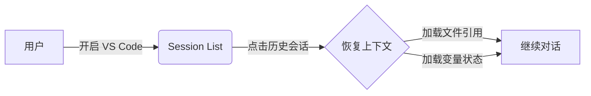
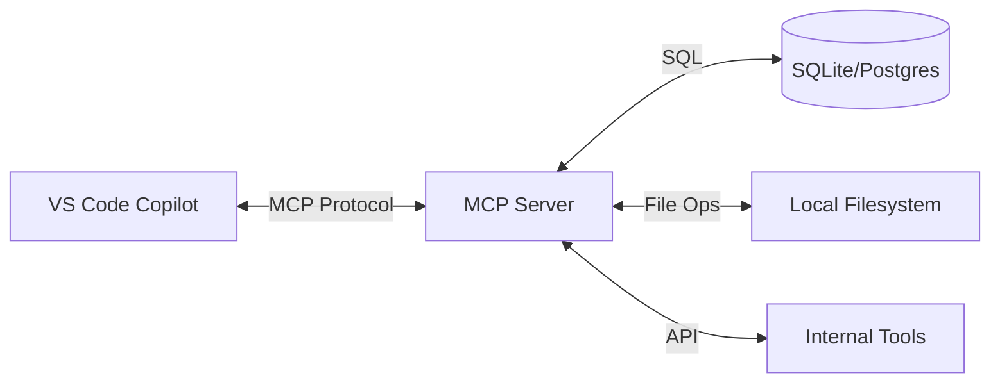
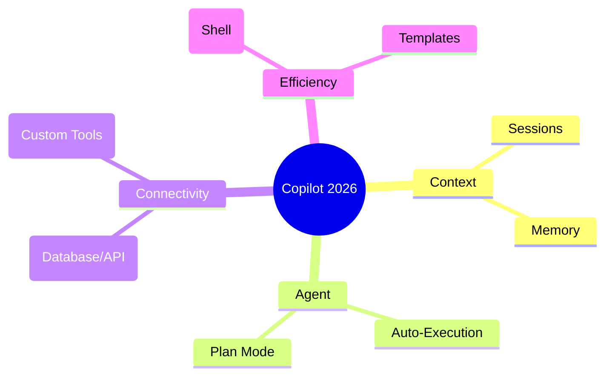

<!-- _class: lead -->

# GitHub Copilot 深度实战培训
## 从基础到 Agent 智能体

### 基于 VS Code 1.109/1.110 最新特性

**讲师**: [Your Name]

---

# 📅 今日议程

<div class="columns-3">

<div>

### 🟢 模块一：基础篇
**新一代交互范式**
- Session Management
- Copilot Memory
- Inline vs Panel

</div>

<div>

### 🔵 模块二：进阶篇
**定制化与自主代理**
- Custom Instructions
- Agent vs Plan Mode
- MCP Protocol

</div>

<div>

### 🟣 模块三：拓展篇
**CLI & Skills 生态**
- Natural Language CLI
- Aliases
- Custom Skills

</div>

</div>

<!-- speaker_note:
欢迎大家参加本次培训。
今天我们的目标不是重复大家已经知道的代码补全功能，而是深入挖掘 VS Code 1.109 版本以来引入的全新特性。
我们将从基础的会话管理开始，进入最激动人心的 Agent 自主模式，最后探索如何通过 MCP 和 Skills 扩展 Copilot 的能力边界。
-->

---

<!-- _class: lead -->

# 🟢 模块一：基础篇
## 新一代交互范式

---

# 告别“健忘”的 AI

**传统体验**:
- 每次打开窗口都是“新的一天”。
- 需要重复粘贴上下文。
- AI 记不住你的代码风格偏好。

**VS Code 1.109+ 新体验**:
- **Sessions**: 跨窗口、跨时间的上下文保持。
- **Memory**: 项目级的偏好记忆。

<!-- speaker_note:
大家有没有这种经历？昨天跟 Copilot 聊了一下午的代码重构，今天早上打开电脑，它全忘了。
VS Code 1.109 彻底改变了这一点。
-->

---

# Agent Session Management

**核心能力**:
1.  **历史记录**: 访问过去 30 天的对话。
2.  **上下文恢复**: 点击历史记录，瞬间恢复当时的文件引用和变量状态。
3.  **重命名与管理**: 为关键会话命名（如 "Debug Auth"），便于检索。



<!-- speaker_note:
请大家打开 VS Code 的 Chat 面板，点击右上角的“时钟”图标。
这就是 Session History。
实战演练：请大家找到昨天的一个对话，点击它，看看是否能无缝衔接。
-->

---

# Copilot Memory: 项目偏好

让 AI 记住你的“潜规则”。

**配置方式**:
- **显式指令**: "在这个项目中，永远使用 TypeScript 接口而不是类型别名。"
- **自动推断**: Copilot 会观察你的修改习惯并询问是否保存。

**查看记忆**:
- 输入 `@memory` 或查看 Chat 面板顶部的脑图图标。

<!-- speaker_note:
在 `01-basics/setup-guide.md` 中我们有详细步骤。
现在的实战是：请大家在 Chat 中输入：“在此项目中，所有变量命名必须使用蛇形命名法”。
然后新建一个文件，让 Copilot 生成一段代码，验证它是否遵守了。
-->

---

# Inline Chat vs Panel Chat (1/2)

| 特性 | Inline Chat (`Cmd+I`) | Panel Chat (`Cmd+L`) |
| :--- | :--- | :--- |
| **位置** | 编辑器光标处 | 侧边栏 |
| **核心交互** | **Diff 视图** (接受/拒绝) | **对话流** (插入/复制) |
| **最佳场景** | 局部重构、修复 Bug | 复杂问答、解释代码 |

<!-- speaker_note:
很多同学混淆这两个入口。
记住一个原则：如果你想“改”代码，用 Inline；如果你想“聊”代码，用 Panel。
-->

---

# Inline Chat vs Panel Chat (2/2)

### 实战演示

**场景 A: 快速修复 (Inline)**
> 选中 `calculator.js` 中的 `add` 函数 -> `Cmd+I` -> "Convert to arrow function"

**场景 B: 架构咨询 (Panel)**
> 打开 Panel -> "@workspace 如何优化这个计算器模块的扩展性？"

```javascript
// calculator.js 示例
function add(a, b) {
  return a + b;
}
// 选中上方代码，使用 Cmd+I 快速重构
```

<!-- speaker_note:
现在请大家打开 `01-basics/examples/calculator.js`。
我们要现场演示这两种模式的区别。
首先，选中 add 函数，Ctrl+I，输入 "Change to arrow function"。
看，它是直接在代码里展示 Diff，非常直观。
-->

---

<!-- _class: lead -->

# 🔵 模块二：进阶篇
## 定制化与自主代理

---

# Custom Instructions

通过 `.github/copilot-instructions.md` 文件，为 Copilot 设定全局的人设和规范。

**文件结构**:
```markdown
# Role
You are a Senior Java Developer.

# Code Style
- Use Streams API where possible.
- Always add JavaDoc.

# Constraints
- No external libraries without permission.
```

<!-- speaker_note:
这就像是给 Copilot 发了一本“员工手册”。
一旦你在仓库根目录建立了这个文件，Copilot 的每一次回答都会先“阅读”这个文件。
-->

---

# Prompt Files (`.prompt.md`)

将复杂的 Prompt 工程化、版本化。

**模板示例 (`refactor-complex.prompt.md`)**:
```markdown
---
name: Refactor Module
description: Standard process for refactoring legacy code
---
# Context
Refactoring file: {{active_file}}

# Steps
1. Analyze dependencies.
2. Create unit tests for current behavior.
3. Apply changes.
4. Verify tests pass.
```

<!-- speaker_note:
不要每次都手敲几百字的 Prompt。
把常用的 Prompt 保存为 `.prompt.md` 文件。
在 Chat 中输入 `/` 就能直接调用它们！
-->

---

# Agent Mode (自主模式)

**定义**: Copilot 不再只是“建议者”，而是“执行者”。它可以自主运行终端命令、创建文件、修改代码。

**演示场景**:
> "读取 `input.csv`，计算平均分，并将结果写入 `output.txt`。如果文件不存在，先创建它。"

**Agent 行为**:
1.  检查文件是否存在 (`ls`).
2.  创建 Python 脚本 (`touch`).
3.  写入代码 (`write`).
4.  运行脚本 (`python script.py`).
5.  报告结果。

<!-- speaker_note:
这是 VS Code 1.109 最炸裂的功能。
请大家进入 `02-advanced/agent-mode-demo` 目录。
我们将在 Panel Chat 中切换到 "Agent" 模式（如果可用），或者直接用自然语言下达这个复杂的指令。
观察它如何一步步自己操作终端。
-->

---

# Plan Mode (思维链规划)

面对超大型任务（如“设计电商系统”），Copilot 会先**思考**，再**行动**。

**工作流**:
1.  **User**: "设计一个订单处理系统"
2.  **Copilot Plan**:
    - [ ] 设计数据库 Schema
    - [ ] 定义 API 接口
    - [ ] 编写核心逻辑
3.  **User**: "批准计划"
4.  **Copilot**: 依次执行每一步。

<!-- speaker_note:
Plan Mode 是为了解决 AI "瞎干" 的问题。
它会先列出一个 Checklist，让你确认。
这在 `02-advanced/plan-mode-demo` 中有详细案例。
-->

---

# MCP (Model Context Protocol)

**连接万物**: 让 Copilot 走出编辑器，连接你的本地数据库、文件系统、甚至内部 API。

**架构图**:



<!-- speaker_note:
Copilot 以前是瞎子，看不到你数据库里有什么数据。
MCP 给了它眼睛和手。
通过简单的 JSON 配置，Copilot 就能直接查询数据库。
-->

---

# MCP 实战配置

**配置文件 (`mcp-servers.json`)**:

```json
{
  "mcpServers": {
    "sqlite": {
      "command": "uvx",
      "args": ["mcp-server-sqlite", "--db-path", "./test.db"]
    },
    "filesystem": {
      "command": "npx",
      "args": ["@modelcontextprotocol/server-filesystem", "/path/to/files"]
    }
  }
}
```

**实战指令**:
> "查询 `users` 表中最近注册的 5 个用户。"

<!-- speaker_note:
请大家打开 `02-advanced/mcp-configs/sqlite-mcp.json`。
这就是连接 SQLite 的钥匙。
配置好后，你甚至不需要写 SQL，直接问 Copilot 数据库里的问题。
-->

---

<!-- _class: lead -->

# 🟣 模块三：拓展篇
## CLI 效率与 Skills 生态

---

# Copilot CLI: 终端革命

**痛点**: 记不住 `tar`, `ffmpeg`, `kubectl` 的复杂参数。

**解决方案**:
- `gh copilot suggest "extract archive.tar.gz to /tmp"`
- `gh copilot explain "chmod 777 -R ."`

**别名魔法 (`??`)**:
```bash
?? kill process using port 8080
```
> Result: `lsof -i :8080 | xargs kill -9`

<!-- speaker_note:
谁能背下来 `tar` 的所有参数？
Copilot CLI 就是你的外挂。
我们在 `03-cli-skills/aliases` 里为大家准备了高效的别名配置。
-->

---

# Custom Skills: 构建专属能力

**什么是 Skill?**
一个轻量级的插件，包含 `manifest.json` 和执行脚本。

**结构 (`sample-custom-skill/`)**:
- `manifest.json`: 定义 Skill 的名字、命令、参数。
- `index.js`: 接收输入 (JSON)，返回输出 (JSON)。

**工作流**:
1.  用户输入: `@unit-test-generator gen tests for login.js`
2.  Copilot 调用: `node index.js` (传入 content)
3.  Skill 返回: 生成的测试代码。
4.  Copilot 展示: 在 Chat 中显示结果。

<!-- speaker_note:
如果官方功能不够用怎么办？自己写！
Skills 让你能够把公司内部的工具链集成进 Copilot。
比如：自动生成符合公司规范的 Unit Test。
-->

---

<!-- _class: lead -->

# 📝 总结与动手实验

---

# 核心回顾



<!-- speaker_note:
这就是今天的全景图。
从 Context 的保持，到 Agent 的自主能力，再到 MCP 的无限连接。
Copilot 已经进化为一个平台。
-->

---

# 🧪 动手实验指引

请完成以下实验 (Repo: `github-copilot-workshop-2026`):

1.  **基础实验**:
    - 在 `01-basics` 中配置 Memory，并尝试 Inline Chat 重构 `calculator.js`。
2.  **进阶实验**:
    - 按照 `02-advanced/mcp-setup-guide.md` 配置 SQLite 连接。
    - 尝试让 Copilot 查询数据库。
3.  **拓展实验**:
    - 运行 `03-cli-skills/sample-custom-skill`，体验自定义 Skill 的开发流程。

---

<!-- _class: lead -->

# Q & A

### 感谢参与

Repo: https://github.com/gaoshanj/github-copilot-workshop-2026

<!-- speaker_note:
感谢大家的时间。
现在开放提问环节。
-->
