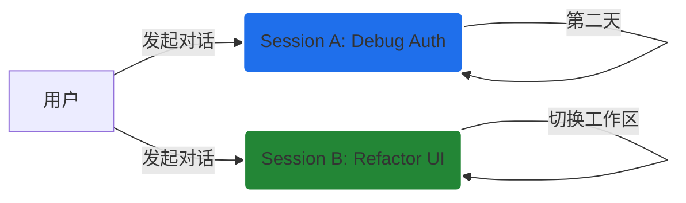
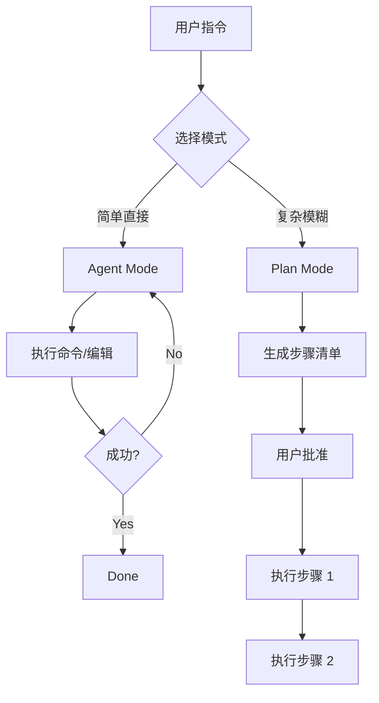
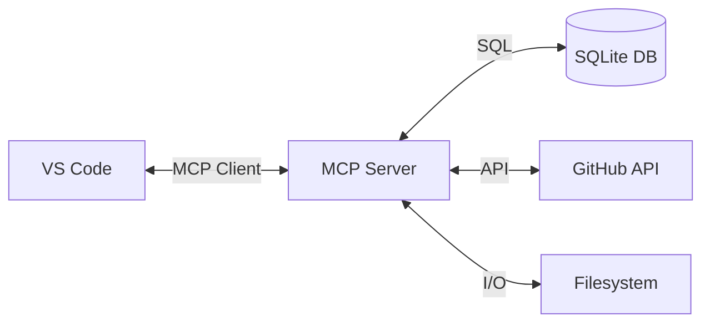
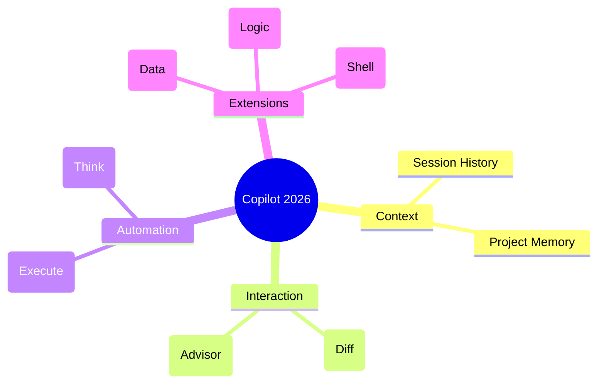

<!-- _class: lead -->

# GitHub Copilot
## 深度实战培训

### 2026 Edition (VS Code 1.109+)

**讲师**: [Your Name]

<!-- speaker_note:
大家好，欢迎来到 GitHub Copilot 深度实战培训。
我是今天的讲师。
在接下来的几个小时里，我们将彻底改变你使用 Copilot 的方式。
如果你还把它当作一个简单的“代码补全工具”，那么这堂课将会颠覆你的认知。
我们将探索 VS Code 1.109 版本带来的革命性变化，从“记忆”到“自主代理”，再到连接万物的 MCP 协议。
-->

---

# 👨‍🏫 讲师介绍

<div class="columns">

<div>

### [Your Name]
**Senior Developer / AI Advocate**

- 10+ 年全栈开发经验
- GitHub Copilot 早期使用者
- 专注于 AI 辅助编程与工程效能

</div>

<div>

### 核心专长
- Cloud Native Architecture
- TypeScript / Python / Go
- DevSecOps
- AI Agent Development

</div>

</div>

<!-- speaker_note:
简单介绍一下我自己。
（请根据实际情况补充您的背景故事）
我之所以热衷于 Copilot，是因为它不仅提高了我的效率，更重要的是，它改变了我解决问题的思路。
今天，我想把这些经验毫无保留地分享给大家。
-->

---

# 📅 培训议程 (Timeline)

```mermaid
gantt
    title 今日课程路线图
    dateFormat  HH:mm
    axisFormat  %H:%M
    
    section 模块一 (基础)
    Session & Memory       :a1, 09:00, 30m
    Chat Modes             :a2, after a1, 30m
    
    section 模块二 (进阶)
    Custom Instructions    :b1, 10:15, 30m
    Agent vs Plan Mode     :b2, after b1, 45m
    MCP Protocol           :b3, after b2, 45m
    
    section 模块三 (拓展)
    CLI & Aliases          :c1, 13:30, 30m
    Custom Skills          :c2, after c1, 45m
    
    section 总结
    Labs & Q&A             :d1, 15:00, 30m
```



<!-- speaker_note:
这是我们今天的路线图。
上午我们将集中攻克基础和进阶的核心概念。
下午我们将进入更具挑战性的 CLI 和 Skills 开发。
请大家确保电脑电量充足，VS Code 已更新到最新版本。
-->

---

<!-- _class: lead -->

# 🟢 模块一：基础篇
## 新一代交互范式

<!-- speaker_note:
让我们开始第一个模块。
VS Code 1.109 是 Copilot 发展史上的一个里程碑。
它引入了两个让 AI 变得“像人”的关键特性：记忆 (Memory) 和 会话 (Session)。
-->

---

# 🧠 痛点：为什么 AI 总是“健忘”？

**传统 Copilot 的局限性**:
1.  **无状态**: 每次打开新窗口，AI 都是一张白纸。
2.  **重复劳动**: 每次都要重复 prompt ("我是用 TypeScript 的...")。
3.  **上下文丢失**: 昨天聊得好好的重构思路，今天全忘了。

**VS Code 1.109+ 的解决方案**:
- **Sessions**: 像微信聊天记录一样保存对话。
- **Memory**: 像大脑一样记住你的偏好。

<!-- speaker_note:
大家有没有这种痛苦的经历？
为了让 Copilot 写对一个组件，你花了10分钟解释你的架构。
第二天早上打开电脑，你得重新解释一遍。
这不仅浪费时间，更让人沮丧。
今天，我们要彻底解决这个问题。
-->

---

# 📚 Session Management (会话管理)

**核心概念**: 对话不再是“用完即扔”的，而是**持久化**的资产。



- **历史回溯**: 访问过去 30 天的对话。
- **上下文恢复**: 自动加载当时引用的文件。

<!-- speaker_note:
Session 不仅仅是保存文本，它保存的是“上下文快照”。
当你点击历史记录中的某一条时，VS Code 会尝试恢复当时你打开的文件、选中的代码。
这意味着你可以同时进行多个任务：一个 Session 专门修 Bug，另一个 Session 专门写文档，互不干扰。
-->

---

# 🛠️ 实操：管理你的 Sessions

**现在请打开 VS Code**:

1.  打开 Chat 面板 (`Ctrl+Alt+I` / `Cmd+L`)。
2.  点击右上角的 **History (时钟图标)**。
3.  找到昨天的任意一条记录，点击进入。
4.  **右键点击**该 Session -> 选择 **Rename**。
5.  重命名为 `"Workshop Demo Session"`。

> **提示**: 养成给重要会话命名的习惯，就像给代码分支命名一样。

<!-- speaker_note:
(等待学员操作)
大家看到了吗？
所有的对话都在这里。
试着切回你刚才重命名的 Session，AI 是否还记得刚才的上下文？
-->

---

# 🧠 Copilot Memory (项目记忆)

让 AI 记住你的“潜规则”。

**配置步骤**:
1.  打开 Settings (`Ctrl+,`).
2.  搜索 `github.copilot.memory`.
3.  勾选 **Enable**。

**如何“植入”记忆**:
> "在这个项目中，不管是前端还是后端，请总是使用 TypeScript，并且使用 async/await 风格。"

**查看记忆**:
- 输入 `@memory` (在支持的版本中) 或查看 Chat 面板顶部的脑图图标。

<!-- speaker_note:
Memory 是项目级别的。
这意味着你在 Project A 告诉它用 React，在 Project B 告诉它用 Vue。
它不会搞混。它知道在哪个山头唱哪支歌。
现在，请大家尝试对 Copilot 说一句设定偏好的话。
-->

---

# ⚔️ Inline vs Panel: 巅峰对决

| 维度 | Inline Chat (`Ctrl+I`) | Panel Chat (`Ctrl+Alt+I`) |
| :--- | :--- | :--- |
| **定位** | **执行者 (Doer)** | **顾问 (Advisor)** |
| **交互** | 原地 Diff (Accept/Discard) | 对话流 (Copy/Insert) |
| **上下文** | 聚焦于当前光标/选区 | 聚焦于整个 Workspace |
| **典型 Prompt** | "Fix this typo", "Add logging" | "Explain how auth works", "Plan refactoring" |

<!-- speaker_note:
很多同学问我：到底什么时候用哪个？
我的原则是：
如果你手在键盘上，眼在代码里，只想改几行代码 -> Inline。
如果你需要停下来思考，需要看多个文件，或者需要解释 -> Panel。
-->

---

# ⚡ Inline Chat: 极速重构

**实操任务**:
1.  打开 `01-basics/examples/calculator.js`。
2.  选中 `add` 函数。
3.  按下 `Ctrl+I`。
4.  输入: `"Convert to arrow function"`。
5.  **观察 Diff 视图**，按下 `Ctrl+Enter` 接受。

```javascript
// Before
function add(a, b) {
  return a + b;
}

// After (Inline Chat 自动生成)
const add = (a, b) => a + b;
```

<!-- speaker_note:
Inline Chat 的杀手锏是 Diff 视图。
你不需要复制粘贴，不需要自己去对比哪里改了。
它直接把旧代码和新代码叠在一起让你审阅。
这对于 Code Review 或是快速修复非常高效。
-->

---

# 💬 Panel Chat: 深度咨询

**实操任务**:
1.  保持 `calculator.js` 打开。
2.  打开 Panel Chat。
3.  输入: `"@workspace Explain the error handling logic in this file."`
4.  Copilot 将分析全文件，并解释 `divide` 函数中的 throw 逻辑。

> **关键点**: 使用 `@workspace` 能够让 Copilot 扫描整个项目索引，而不仅仅是当前文件。

<!-- speaker_note:
注意这里的 `@workspace`。
这是一个 Scope（作用域）。
如果你不加这个，Copilot 主要看你当前打开的文件。
加了 `@workspace`，它就会去检索项目里的其他相关文件。
这是做架构分析时的必备技能。
-->

---

# 💡 效率技巧 (Efficiency Tip)

### 快捷键组合拳

1.  **快速采纳**: 在 Inline Chat 中，直接按 `Ctrl+Enter` 接受修改，按 `Esc` 拒绝。
2.  **一键修复**: 遇到红波浪线报错？光标移上去，按 `Ctrl+.` -> 选择 **Fix with Copilot**。
3.  **模式切换**: 在 Panel Chat 输入框，按 `Up/Down` 箭头可以快速回溯历史 Prompt。

<!-- speaker_note:
记住这些快捷键，每天能为你节省 10 分钟。
特别是 `Ctrl+.`，它是这一代 IDE 最被低估的功能之一。
-->

---

# ⚠️ 常见陷阱 (Trap)

### 1. 记忆错乱
- **现象**: Copilot 似乎记住了一些错误的偏好。
- **解法**: 显式告诉它 "Forget what I said about X"，或者在 Memory 管理界面手动删除该条目。

### 2. 上下文过载
- **现象**: 开了太多文件，Copilot 回答变慢或不相关。
- **解法**: 关闭不相关的 Tab，或者在 Panel Chat 中使用 `/clear` 命令清空当前会话上下文。

<!-- speaker_note:
Memory 虽好，但也可能变成负担。
如果你发现 Copilot 总是顽固地坚持一个你已经废弃的规范。
请务必去检查一下它的 Memory。
-->

---

<!-- _class: lead -->

# 🔵 模块二：进阶篇
## 定制化与自主代理

<!-- speaker_note:
欢迎来到进阶篇。
如果说基础篇是把 Copilot 当工具用。
进阶篇就是把 Copilot 当同事用。
我们将赋予它“人设”，并给它“手脚”。
-->

---

# 🎭 Custom Instructions (人设定制)

通过 `.github/copilot-instructions.md` 文件，为 Copilot 设定全局的**行为准则**。

**核心价值**:
- **统一规范**: 确保团队所有人的 Copilot 都遵循相同的代码风格。
- **减少废话**: 避免 Copilot 每次都解释显而易见的知识。

<!-- speaker_note:
这是一个配置文件，放在仓库的 `.github` 目录下。
一旦生效，它对所有与该仓库互动的 Copilot 都会起作用。
-->

---

# 📝 模板解析 (`copilot-instructions.md`)

```markdown
# Role
You are an expert full-stack developer specializing in TypeScript.

# Code Style
- **Naming**: Variables/Functions: camelCase; Components: PascalCase.
- **Formatting**: Use 2 spaces indentation.

# Constraints
- **Do not** use `any` type.
- **Do not** import from 'dist' folder.

# Tone
Be professional, concise. Avoid over-explaining standard syntax.
```
*(引用自 `02-advanced/templates/copilot-instructions.md.template`)*

<!-- speaker_note:
请看这个模板。
它定义了四个维度：角色、风格、约束、语气。
特别是 Constraints（约束），非常重要。
比如你可以规定“绝对不要使用 eval()”或者“只允许使用特定的日期库”。
-->

---

# 📑 Prompt Files (Prompt 工程化)

将复杂的 Prompt 保存为 `.prompt.md` 文件，实现**版本控制**和**团队共享**。

**使用场景**:
- 复杂的重构任务
- 编写特定格式的文档
- 代码审计流程

**调用方式**:
在 Chat 中输入 `/` 即可看到仓库中定义的 Prompt Files。

<!-- speaker_note:
大家有没有觉得，写好一个 Prompt 很累？
写好了如果不保存，下次还要重新写。
Prompt Files 就是 Prompt 的“代码化”。
你可以把它提交到 Git，全团队共享。
-->

---

# 🤖 Agent Mode vs Plan Mode

| 模式 | 核心逻辑 | 适用场景 |
| :--- | :--- | :--- |
| **Agent Mode** | **自主循环 (Loop)**: 思考 -> 执行 -> 观察 -> 再思考 | 自动化任务（运行脚本、修改多文件） |
| **Plan Mode** | **思维链 (CoT)**: 预先规划 -> 用户确认 -> 逐步执行 | 复杂需求（新功能开发、系统设计） |



<!-- speaker_note:
这是本节课的重难点。
Agent Mode 是“行动派”，它会自己去试错。
Plan Mode 是“规划派”，它会先写 PPT（计划书），再干活。
-->

---

# 🚀 Agent Mode 实战

**任务**: "读取 `input.csv`，计算平均分，写入 `output.txt`。"

**Agent 的心理活动**:
1.  `ls` (我看下文件在不在？不在。)
2.  `touch data_processor.py` (那我建个脚本。)
3.  `write` (写入 Python 代码...)
4.  `python data_processor.py` (运行一下...)
5.  `cat output.txt` (检查结果...)
6.  "完成任务，结果是 85.5。"

> **实操**: 进入 `02-advanced/agent-mode-demo` 体验此流程。

<!-- speaker_note:
这不仅仅是代码生成。
这是代码生成 + 终端执行 + 错误修正。
如果脚本报错了，Agent 会自己读错误日志，自己修代码，再运行。
完全不需要你插手。
-->

---

# 🗺️ Plan Mode 实战

**任务**: "设计一个电商订单系统。"

**Copilot 生成的计划**:
- [ ] **Step 1**: Create `Order` and `Product` interfaces.
- [ ] **Step 2**: Implement `OrderService` class.
- [ ] **Step 3**: Add validation logic for stock.
- [ ] **Step 4**: Write unit tests.

> **实操**: 进入 `02-advanced/plan-mode-demo`，输入 `@workspace /plan Implement requirements.md`。

<!-- speaker_note:
Plan Mode 会生成一个动态的 Checklist。
你可以点击每一步旁边的“执行”按钮。
也可以修改计划，比如删除某一步，或者打乱顺序。
这给了你对 AI 极强的控制感。
-->

---

# 🔌 MCP Protocol: 连接万物

**Model Context Protocol (MCP)** 是 Copilot 的感官延伸。



**为什么需要它？**
- Copilot 默认只能看编辑器里的代码。
- MCP 让它能看数据库、看私有文档、看内部系统。

<!-- speaker_note:
这是 OpenAI 和 Anthropic 都在推的标准。
通过 MCP，我们可以把任何数据源变成 Copilot 的上下文。
-->

---

# ⚙️ MCP 配置实战 (`sqlite-mcp.json`)

```json
{
  "mcpServers": {
    "sqlite": {
      "command": "uvx",
      "args": [
        "mcp-server-sqlite",
        "--db-path",
        "./test.db"
      ]
    }
  }
}
```
*(引用自 `02-advanced/mcp-configs/sqlite-mcp.json`)*

**配置后**:
> User: "查询 users 表中最近注册的用户。"
> Copilot: (自动执行 SQL) `SELECT * FROM users ORDER BY created_at DESC LIMIT 5;`

<!-- speaker_note:
只需要这样一个简单的 JSON 配置。
你就不需要再安装数据库客户端了。
Copilot 直接变身 SQL 专家。
-->

---

# 🏆 学员挑战 (5 min)

**挑战任务**:
1.  在 `02-advanced/mcp-configs/` 目录下创建一个名为 `my-mcp.json` 的文件。
2.  参考 `filesystem-mcp.json`，配置一个允许访问你桌面 (`Desktop`) 的 FileSystem Server。
3.  重启 VS Code。
4.  问 Copilot: "Read the file 'todo.txt' on my desktop." (请先在桌面建一个 todo.txt)。

<!-- speaker_note:
(倒计时 5 分钟)
这个挑战测试大家对 MCP 路径配置的理解。
注意：路径必须是绝对路径。
-->

---

# ⚠️ 进阶陷阱 (Trap)

### 1. Agent "暴走"
- **现象**: Agent Mode 不停地创建错误文件或陷入死循环。
- **解法**: 随时准备点击 **Stop Generating** 按钮。在 Prompt 中明确约束 "Do not create new files unless necessary"。

### 2. MCP 连接失败
- **现象**: Chat 显示 "MCP server error"。
- **解法**: 检查 `uvx` 或 `npx` 是否在 PATH 环境变量中。检查 JSON 配置中的路径是否使用了绝对路径 (Windows 下要注意反斜杠转义)。

<!-- speaker_note:
Agent 能力越强，风险越大。
一定要在沙箱环境或有 Git 版本控制的环境下使用 Agent。
-->

---

<!-- _class: lead -->

# 🟣 模块三：拓展篇
## CLI 效率与 Skills 生态

<!-- speaker_note:
最后这个模块是给极客准备的。
我们将离开舒适的图形界面，进入黑底白字的终端世界。
并将亲手开发一个 Copilot 插件。
-->

---

# 💻 Copilot CLI: 终端革命

**核心功能**:
1.  **Suggest**: 将自然语言转换为 Shell 命令。
2.  **Explain**: 解释复杂的 Shell 命令。

**常用场景**:
- Git 复杂操作 ("Undo last commit keeping changes")
- Docker 清理 ("Stop all containers and remove images")
- 文本处理 ("Find all js files and count lines")

<!-- speaker_note:
CLI 工具是独立于 VS Code 的。
你需要单独安装 `github-copilot-cli` (现在通常集成在 `gh` cli 中)。
-->

---

# ⚡ Aliases: 效率倍增器

不要每次都打 `gh copilot suggest`。配置别名 (`??`)！

```bash
# Add to .bashrc or .zshrc
alias ??='gh copilot suggest -t shell'
alias wtf='gh copilot explain'
alias git?='gh copilot suggest -t git'
```
*(引用自 `03-cli-skills/aliases/.copilot-aliases`)*

**使用效果**:
```bash
$ ?? list files larger than 100MB
# Suggestion: find . -type f -size +100M
```

<!-- speaker_note:
`??` 这个别名非常传神。
当你遇到不会的命令时，打两个问号，Copilot 就来帮你了。
-->

---

# 🧩 Custom Skills: 构建专属能力

**定义**: Skills 是 Copilot 的轻量级插件。

**结构**:
```mermaid
graph LR
    Manifest[manifest.json] -->|定义入口| Script[index.js]
    Copilot -->|StdIn (JSON)| Script
    Script -->|StdOut (JSON)| Copilot
```

**应用场景**:
- 内部 API 调用 (e.g., "Check ticket status Jira-123")
- 特定代码生成 (e.g., "Generate Unit Test for Login")
- 运维脚本触发 (e.g., "Deploy to staging")

<!-- speaker_note:
Skills 的原理非常简单，就是标准输入输出。
你可以用 Python, Node.js, Go 甚至 Shell 写 Skill。
只要能读 JSON，吐 JSON 即可。
-->

---

# 🛠️ Skill 开发流程详解

**Manifest (`manifest.json`)**:
```json
{
  "name": "unit-test-generator",
  "version": "1.0.0",
  "commands": [
    {
      "name": "generate",
      "executable": "node",
      "arguments": ["index.js"]
    }
  ]
}
```
*(引用自 `03-cli-skills/sample-custom-skill/manifest.json`)*

**关键点**:
- `name`: 必须唯一，作为调用前缀 (`@unit-test-generator`).
- `executable`: 执行环境。

<!-- speaker_note:
这是 Skill 的身份证。
Copilot 读取这个文件来知道如何调用你的程序。
-->

---

# ⚠️ 拓展陷阱 (Trap)

### 1. CLI 认证失效
- **现象**: `gh copilot` 提示未登录。
- **解法**: 运行 `gh auth login` 并确保选择了 `GitHub.com` 且授权了 Copilot 权限。

### 2. Skill 响应超时
- **现象**: Copilot 等待很久后报错。
- **解法**: Skill 必须在几秒内返回 JSON。如果是耗时操作，应立即返回 "Started" 状态，并通过其他方式通知结果。

<!-- speaker_note:
Skill 开发中最常见的问题就是 JSON 格式错误。
哪怕多输出了一行 `console.log` 的调试信息，都会导致 JSON 解析失败。
一定要确保 stdout 只输出纯净的 JSON。
-->

---

<!-- _class: lead -->

# 📝 总结与实验
## Summary & Labs

---

# 🗺️ 知识地图 (Knowledge Map)



<!-- speaker_note:
这就是我们今天学到的所有内容。
从最基础的 Context 管理，到最高级的 Agent 自动化。
Copilot 的能力版图正在飞速扩张。
-->

---

# 🧪 动手实验 (Lab Tasks)

请在课后完成以下三个实验：

1.  **Lab 1: Memory & Refactor**
    - 配置一条关于代码注释风格的 Memory。
    - 使用 Inline Chat 重构 `01-basics/examples/calculator.js`，验证 Memory 是否生效。

2.  **Lab 2: MCP Connection**
    - 运行 `02-advanced/mcp-configs/sqlite-mcp.json`。
    - 在 Chat 中查询数据库表结构。

3.  **Lab 3: Build a Skill**
    - 运行 `03-cli-skills/sample-custom-skill`。
    - 修改 `index.js`，使其能生成 Python 的 `unittest` 代码。

<!-- speaker_note:
光听不练假把式。
这三个实验分别对应了今天的三个模块。
完成它们，你才能真正掌握 GitHub Copilot 的精髓。
-->

---

<!-- _class: lead -->

# Q & A

### 感谢聆听

**Repository**: https://github.com/gaoshanj/github-copilot-workshop-2026

<div class="small-text">
Generate PDF: marp slides.md -o slides.pdf
</div>

<!-- speaker_note:
感谢大家的时间。
现在把时间交给你们，有什么问题，欢迎提问。
-->
